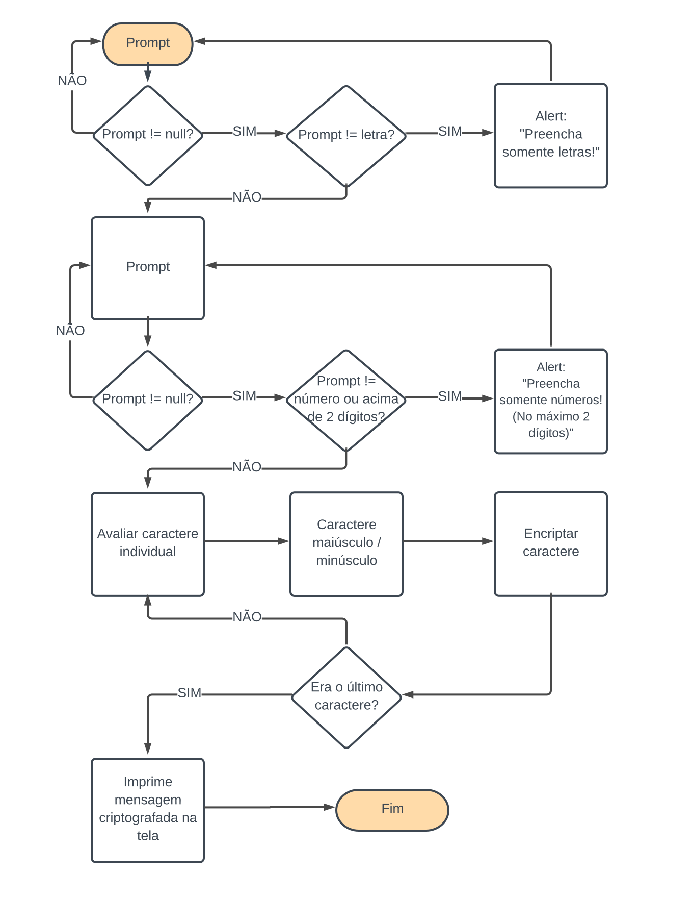

- Prompt solicita a mensagem a ser criptografada
- Caso o usuário clique em cancelar ou tente submeter em branco, o prompt voltará a aparecer
- Caso o usuário tente preencher com algum caractere diferente de letra, aparecerá a mensagem "Preencha somente letras!"
- Prompt solicita chave a ser usada para Descriptografar
- Caso o usuário clique em cancelar ou tente submeter em branco, o prompt voltará a aparecer
- Caso o usuário tente preencher com algum caractere diferente de número, ou inserir mais de 2 dígitos, aparecerá a mensagem "Preencha somente números! (No máximo 2 dígitos)"
- Inicia a função cipher onload
- A função avalia se o caractere é uma letra maiuscula ou minuscula e aplica a fórmula de encriptação correspondente
- Aparece a mensagem criptografada
- Ao clicar no botão "Descriptografar", inicia a função decipher
- A função avalia se o caractere é uma letra maiuscula ou minuscula e aplica a fórmula de encriptação correspondente

